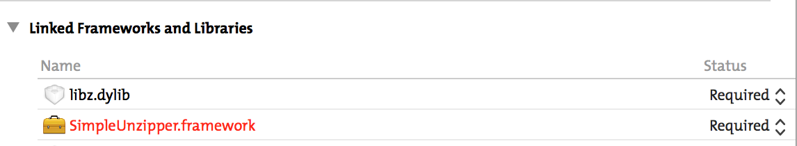
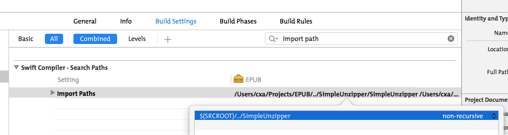

# SimpleUnzipper

Unzip single, unencrypted (no password), non-zip64 (large than 4GB) files, written in Swift 1.2. It's driven by a private (currently) EPUB parser project, since EPUB is simply a zip file.

## Installation

`SimpleUnzipper` is encapsulated as a Framework. Drag `SimpleUnzipper.xcodeproj` into your project, add `libz.dylib` and `SimpleUnzipper` to “Linked Frameworks and Libraries” under “General” tab of target settings.



The most important step, don't forget to add correct path which contains `SimpleUnzipper` to target's `Build Settings` -> `Swift Compiler - Search Paths` -> `Import Paths`. As below shows, `SimpleUnzipper` is on the same directory as the target project.



If you add `SimpleUnzipper` inside your project dirctory, the `Import Paths` should be `$(SRCROOT)/SimpleUnzipper`


## Example

SimpleUnzipper is very simple as its name, contains only a few public properties and methods.

```swift
import SimpleUnzipper
...
// create an unzipper with file URL or data
if let unzipper = SimpleUnzipper.createWithURL(url) {
  // or SimpleUnzipper.createWithData(data)
  
  // get all file names, including paths if available
  let files = unzipper.files
  
  // check if a file available
  let isAvailable = unzipper.containsFile("path/to/file.ext")
  
  // get data from a file
  let data = unzipper.dataForFile("path/to/file.ext")
  
}
```
		
## About Me

* Twitter: [@_cxa](https://twitter.com/_cxa)
* Apps available in App Store: <http://lazyapps.com>
* PayPal: xianan.chen+paypal 📧 gmail.com, buy me a cup of coffee if you find it's useful for you.

## Credits

Test example file `test.epub` is downloaded from <https://code.google.com/p/epub-samples/>


## License

Under the MIT license. See the LICENSE file for more information. For non attributed commercial lisence, please contact me.
